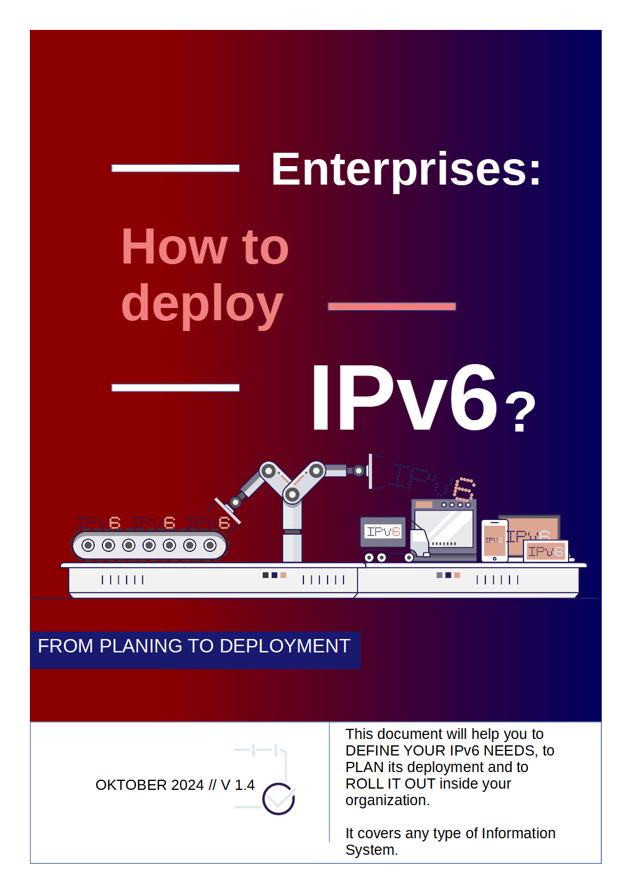

= ENTERPRISES: HOW TO DEPLOY IPv6?
:author: Jean-Charles BISECCO
:email: ipv6@arcep.fr
:revnumber: v1.4
:revdate: 20.10.2024
:description: This document will help you to DEFINE YOUR IPv6 NEEDS, to PLAN its deployment and to ROLL IT OUT inside your organization.
:toc: preamble
:toclevels: 5
:source-highlighter: rouge
:numbered:
:doctype: book
:notitle:
:sectnumlevels: 0
:partnums:
//icons instead of text for admonitions
:icons: font
:docinfodir: styles
:docinfo1:
//:stylesheet: chapter.css

// Table of content - MUST be localized
:toc-title: Table of contents
:chapter-label: Chapter
// Don't display a title page, since we have a cover image. Cover image - it's too complex to let ASCIIDOCTOR do this job; see sources folder

//:title-page-background-image: 

// Include the non-numbered sections (Forewaord and Preamble).
== Foreword
include::chapters/foreword.adoc[]

== Preamble
include::chapters/preamble.adoc[]

// Enable chapter numbering.
:sectnums:

// Include the numbered chapters.
== Grasp of the subject
include::chapters/chapter-01.adoc[]

== Transition Technologies
include::chapters/chapter-02.adoc[]

== Block sequencing
include::chapters/chapter-03.adoc[]

== Addressing plan
include::chapters/chapter-04.adoc[]

== Security and best practices
include::chapters/chapter-05.adoc[]

== Appendix
include::chapters/chapter-06.adoc[]

// Disable chapter numbering
:sectnums!:

// Include section "about this book"
== About this document
include::chapters/about.adoc[]

//#### End of main.adoc ####