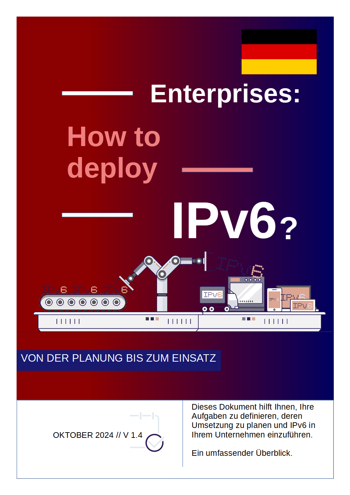

= ENTERPRISES: How to deploy IPv6? (Deutsche Version)
:author: Jean-Charles BISECCO, Axel Schemberg (Übersetzung)
:email: ipv6@arcep.fr
:revnumber: v1.4
:revdate: 20.10.2024
:description: Dieses Dokument hilft Ihnen, Ihre IPv6-Hausaufgaben zu finden, deren Umsetzung zu planen und IPv6 in Ihrem Unternehmen einzusetzen.
:toc: preamble
:toclevels: 5
:source-highlighter: rouge
:numbered:
:doctype: book
:notitle:
:sectnumlevels: 0
:partnums:
//Kapitelnummern
:num:
//icons statt Text für admonitions
:icons: font
:docinfodir: styles
:docinfo1:
:stylesheet: chapter.css

// Table of content - localized to German
:toc-title: Inhaltsverzeichnis
:chapter-label: Kapitel
:figure-caption: Abbildung
:part-signifier: Teil
:lang: de
// Don't display a title page, since we have a cover image. Cover image - it's too complex to let ASCIIDOCTOR do this job; see sources folder

// Nicht nummerierte Kapitel (Vorwort und Präambel).
[preface]
= Vorwort
include::chapters/foreword_de.adoc[]

[preface]
= Präambel
include::chapters/preamble_de.adoc[]

// Nummerierung aktivieren.
:sectnums:

// Nummerierte Kapitel.
= Einführung
include::chapters/chapter-01_de.adoc[]

= Transition Techniken
include::chapters/chapter-02_de.adoc[]

= Einzelteile
include::chapters/chapter-03_de.adoc[]

= Adressplan
include::chapters/chapter-04_de.adoc[]

= Sicherheit und Best Practises
include::chapters/chapter-05_de.adoc[]

[appendix]
= Anhang
include::chapters/chapter-06_de.adoc[]

// Nummerierung deaktivieren
:sectnums!:
// Kapitel "Über dieses Dokument" einfügen
[appendix]
= Über dieses Dokument
include::chapters/about_de.adoc[]

//#### End of main.adoc ####